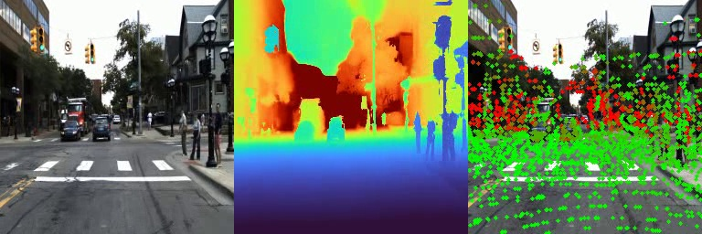
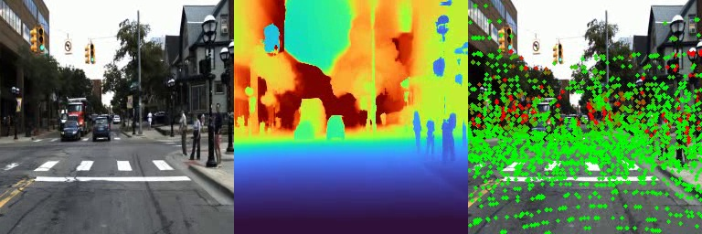
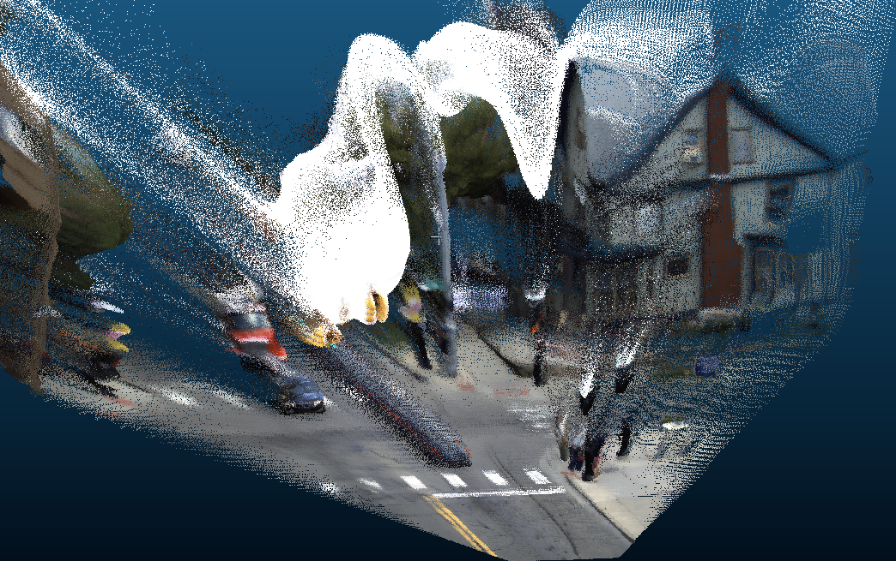
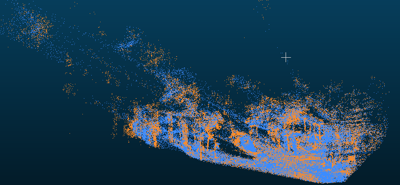

<div align="center">
  <h1>OpenD4RT-DDAD：稀疏 LiDAR 监督微调与三维重建</h1>
  <p><strong>使用 50% local / 50% reference-0 稀疏 LiDAR 监督进行 DDAD 三维重建微调</strong></p>
  <p>
    <a href="README_OpenD4RT.md">OpenD4RT 原始 README</a> |
    <a href="docs/ddad_training_plan.md">训练设计</a> |
    <a href="docs/ddad_forward_runbook.md">评估手册</a>
  </p>
</div>

## 项目简介

本项目基于民间开源实现 [OpenD4RT](README_OpenD4RT.md)，将 D4RT 的视频查询式
三维重建能力适配到 DDAD 自动驾驶数据集。项目保留 OpenD4RT 的模型结构和 query
接口，新增 DDAD/DGP 数据读取、LiDAR 到相机的稀疏监督构造、DDAD 微调、重建评估和
可视化流程。

DDAD 不提供 D4RT 跟踪评估所需的长期点轨迹 GT，因此本项目只训练和评估三维重建，
不报告 tracking 指标。

## OpenD4RT 基础模型

微调使用 OpenD4RT 发布的 48 帧 checkpoint 初始化：

```text
checkpoints/OpenD4RT_48CLIP_9Mix_NoCropAUG/opend4rt.ckpt
```

该 OpenD4RT 9Mix 基础模型使用以下数据训练：

- PointOdyssey
- Dynamic Replica
- Kubric Full
- TartanAir
- Virtual KITTI 2
- ScanNet / ScanNet++
- BlenderMVS
- CO3D
- MVS-Synth

本项目不是从零训练完整模型，而是在上述基础模型上使用 DDAD 继续微调。OpenD4RT
原始项目介绍、checkpoint 和 WorldTrack 流程见
[README_OpenD4RT.md](README_OpenD4RT.md)。

## DDAD 数据与监督

本地 DDAD 数据共包含 200 个 scene：

| 划分 | Scene 数量 | Scene ID |
| --- | ---: | --- |
| 训练集 | 150 | `000000-000149` |
| 验证集 | 50 | `000150-000199` |

同步 LiDAR 点投影到 `CAMERA_01` 后构造稀疏 `xyz_3d` GT。每个训练 clip
包含 48 帧和 4,096 个 query，并按 query 数精确分成两个监督分支：

| 分支 | 比例 | 每个 clip 的 query 数 | Query | 监督目标 |
| --- | ---: | ---: | --- | --- |
| Local reconstruction | 50% | 2,048 | `(t_src,t_tgt,t_cam)=(t,t,t)` | 在当前第 `t` 帧相机坐标系中重建点 |
| Reference-0 reconstruction | 50% | 2,048 | `(t_src,t_tgt,t_cam)=(t,t,0)` | 在第 0 帧相机坐标系中重建同一点 |

`t_src` 在 clip 内均匀采样，`t_tgt=t_src`，`t_cam` 在当前帧和第 0 帧之间按
50/50 采样。训练启用 mean-depth-normalized `xyz_3d` L1 与 confidence 监督，不使用
点轨迹、2D tracking、visibility 或其他 DDAD 不具备 GT 的任务监督。模型输入分辨率为
`256 x 256`，训练时启用 stride 1-2 的时间子采样，不使用颜色或随机裁剪增强。

本地数据目录格式：

```text
/data/jhc/ddad_train_val/
  000000/
    scene_*.json
    calibration/*.json
    rgb/CAMERA_01/*.png
    point_cloud/LIDAR/*.npz
  ...
  000199/
```

## 环境配置

```bash
conda env create -f environment.yml
conda activate d4rt
```

当前训练和评估使用 Python 3.10、PyTorch 2.6、CUDA 12.4，以及 4 张 48 GB
NVIDIA GeForce RTX 4090。

## 模型训练

最新模型从 OpenD4RT 48 帧 checkpoint 初始化，在 4 张 RTX 4090 48GB 上训练
20,000 step，耗时约 10 小时。每卡 batch size 为 1，每个 optimizer step 共处理 4 个
clip；优化器使用 AdamW，learning rate 经过 500-step warmup 到 `4e-6`，再以 cosine
schedule 衰减到 `4e-7`。训练全程保持精确的 50% local / 50% reference-0 query 比例。

```bash
bash scripts/train_ddad_reconstruction_4gpu.sh \
  --train-config configs/train_ddad_reconstruction_local_ref0_50_50.yaml \
  --output-dir output/ddad_train_local_ref0_50_50 \
  --init-model checkpoints/OpenD4RT_48CLIP_9Mix_NoCropAUG/opend4rt.ckpt \
  --data-root /data/jhc/ddad_train_val \
  --total-steps 20000 \
  --gpus 0,1,2,3
```

正式使用的 checkpoint 按最低 `val_loss_total` 选取，对应 step 16,000：

```text
output/ddad_train_local_ref0_50_50/checkpoints/best.ckpt
```

## 模型评估

### 训练前基线

使用原始 OpenD4RT checkpoint 在 DDAD validation split 上评估：

```bash
bash scripts/eval_ddad_forward_4gpu.sh \
  --model-config checkpoints/OpenD4RT_48CLIP_9Mix_NoCropAUG/model.yaml \
  --ckpt-path checkpoints/OpenD4RT_48CLIP_9Mix_NoCropAUG/opend4rt.ckpt \
  --data-root /data/jhc/ddad_train_val \
  --output-dir output/ddad_eval_opend4rt_base \
  --split val \
  --gpus 0,1,2,3 \
  --no-vis
```

### 训练后模型

```bash
bash scripts/eval_ddad_forward_4gpu.sh \
  --model-config output/ddad_train_local_ref0_50_50/config/model_effective.yaml \
  --ckpt-path output/ddad_train_local_ref0_50_50/checkpoints/best.ckpt \
  --data-root /data/jhc/ddad_train_val \
  --output-dir output/ddad_eval_local_ref0_50_50_best_val \
  --split val \
  --gpus 0,1,2,3 \
  --no-vis
```

Base 和训练后模型使用完全相同的 50 个 validation scene、每个 scene 48 帧。Local 与
reference-0 分支各评估 4,915,200 个有效稀疏 LiDAR query。

## 评估指标

DDAD 评测与模型的尺度无关训练目标保持一致：每个 scene 的全部 local 稀疏点共同估计
一个 median scale，并将这个固定 scale 同时用于 local 和 reference-0 分支。Ref0 不再
单独估计 scale，也不使用旋转、平移或 Sim3 对齐。三个主指标均为越低越好：

- `local_depth_abs_rel_global`：local 坐标系中 scale-aligned 深度的绝对相对误差。
- `local_xyz_epe_global_m`：local 坐标系中 scale-aligned XYZ 的平均欧氏距离，单位为米。
- `ref0_xyz_epe_global_m`：第 0 帧相机坐标系中 XYZ 的平均欧氏距离，使用同一个 local
  scene scale，单位为米。

### 验证集结果

| 模型 | Local depth AbsRel ↓ | Local XYZ EPE ↓ | Ref0 XYZ EPE ↓ |
| --- | ---: | ---: | ---: |
| OpenD4RT Base | 0.15338 | 9.3465 m | 13.8147 m |
| **DDAD 50/50 local-ref0** | **0.09545** | **4.2708 m** | **5.0129 m** |
| 相对改善 | **37.77%** | **54.31%** | **63.71%** |

所有数值均由当前 evaluator 在相同验证集和相同 query 配置下重新计算。旧版逐帧 scale、
raw 和 Sim3 指标不再作为本项目结果报告。

## 重建可视化

每个视频按照以下顺序展示：

```text
RGB | 预测 dense depth | 稀疏 LiDAR 误差叠加
```

稀疏误差图中，绿色点表示误差较小，红色点表示误差较大。Base 和训练后模型均使用
`256 x 256` dense query 网格生成深度与点云，确保可视化分辨率一致。点击预览图可打开
对应的三联 MP4 视频。

<table>
  <tr>
    <th>OpenD4RT Base</th>
    <th>DDAD 50/50 local-ref0</th>
  </tr>
  <tr>
    <td>
      <a href="docs/assets/ddad/scene_000000_base.mp4">
        
      </a>
    </td>
    <td>
      <a href="docs/assets/ddad/scene_000000_local_ref0_50_50.mp4">
        
      </a>
    </td>
  </tr>
</table>

其他 Base / 50/50 对比视频：

| Scene | OpenD4RT Base | DDAD 50/50 local-ref0 |
| --- | --- | --- |
| `000000` | [MP4](docs/assets/ddad/scene_000000_base.mp4) | [MP4](docs/assets/ddad/scene_000000_local_ref0_50_50.mp4) |
| `000001` | [MP4](docs/assets/ddad/scene_000001_base.mp4) | [MP4](docs/assets/ddad/scene_000001_local_ref0_50_50.mp4) |
| `000002` | [MP4](docs/assets/ddad/scene_000002_base.mp4) | [MP4](docs/assets/ddad/scene_000002_local_ref0_50_50.mp4) |
| `000003` | [MP4](docs/assets/ddad/scene_000003_base.mp4) | [MP4](docs/assets/ddad/scene_000003_local_ref0_50_50.mp4) |

这 4 个可视化 scene 来自 DDAD 训练集，用于直观检查模型适配前后的变化；上面的定量
指标只使用 validation split。

### Reference-0 点云

下图为模型使用 `(t_src,t_tgt,t_cam)=(t,t,0)` 直接预测并统一到第 0 帧相机坐标系的
`256 x 256` dense 点云。

<p align="center">
  
</p>

稀疏 LiDAR query 对比中，蓝色为模型直接预测的 reference-0 点，黄色为使用 DDAD GT
pose 变换到第 0 帧相机坐标系的 LiDAR GT。两者使用与定量评估相同的 scene scale。

<p align="center">
  
</p>

## 输出目录

```text
output/
  ddad_train_local_ref0_50_50/         # 50/50 checkpoint、日志、配置、TensorBoard
  ddad_eval_opend4rt_base/             # 当前协议下的 OpenD4RT Base 验证集结果
  ddad_eval_local_ref0_50_50_best_val/ # 当前协议下的训练后验证集结果
  ddad_reconstruction_vis_before/      # OpenD4RT Base 256-grid 可视化
  ddad_vis_local_ref0_50_50_best/      # 训练后 256-grid 可视化
```

