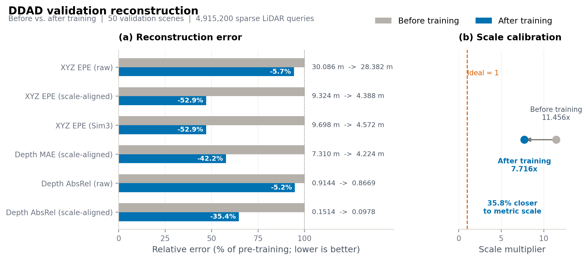
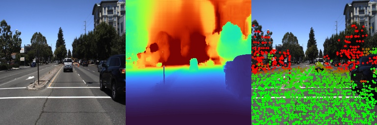
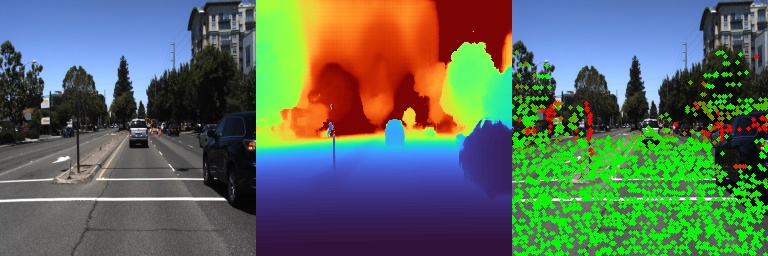

<div align="center">
  <h1>OpenD4RT-DDAD：稀疏 LiDAR 监督微调与三维重建</h1>
  <p><strong>基于 OpenD4RT 完成 DDAD 模型训练、重建评估及训练前后对比</strong></p>
  <p>
    <a href="README_OpenD4RT.md">OpenD4RT 原始 README</a> |
    <a href="docs/ddad_training_plan.md">训练设计</a> |
    <a href="docs/ddad_forward_runbook.md">评估手册</a>
  </p>
</div>

## 项目简介

本项目基于民间开源实现 [OpenD4RT](README_OpenD4RT.md)，将 D4RT 的视频查询式
三维重建能力适配到 DDAD 自动驾驶数据集。项目保留 OpenD4RT 的模型结构和 query
接口，新增 DDAD/DGP 数据读取、LiDAR 到相机的稀疏监督构造、DDAD 微调、重建评估和
可视化流程。

DDAD 不提供 D4RT 跟踪评估所需的长期点轨迹 GT，因此本项目只训练和评估三维重建，
不报告 tracking 指标。

## OpenD4RT 基础模型

微调使用 OpenD4RT 发布的 48 帧 checkpoint 初始化：

```text
checkpoints/OpenD4RT_48CLIP_9Mix_NoCropAUG/opend4rt.ckpt
```

该 OpenD4RT 9Mix 基础模型使用以下数据训练：

- PointOdyssey
- Dynamic Replica
- Kubric Full
- TartanAir
- Virtual KITTI 2
- ScanNet / ScanNet++
- BlenderMVS
- CO3D
- MVS-Synth

本项目不是从零训练完整模型，而是在上述基础模型上使用 DDAD 继续微调。OpenD4RT
原始项目介绍、checkpoint 和 WorldTrack 流程见
[README_OpenD4RT.md](README_OpenD4RT.md)。

## DDAD 数据与监督

本地 DDAD 数据共包含 200 个 scene：

| 划分 | Scene 数量 | Scene ID |
| --- | ---: | --- |
| 训练集 | 150 | `000000-000149` |
| 验证集 | 50 | `000150-000199` |

当前训练配置：

- 相机：`CAMERA_01`
- Clip 长度：48 帧
- 模型输入分辨率：`256 x 256`
- 每个训练 clip 采样 4,096 个稀疏 LiDAR query
- 将同步 LiDAR 点投影到相机坐标系构造 `xyz_3d` GT
- 使用 `t_src = t_tgt = t_cam` 做单帧稀疏三维重建
- 开启 `xyz_3d` 和 confidence 监督
- 不使用点轨迹或 tracking 监督

本地数据目录格式：

```text
/data/jhc/ddad_train_val/
  000000/
    scene_*.json
    calibration/*.json
    rgb/CAMERA_01/*.png
    point_cloud/LIDAR/*.npz
  ...
  000199/
```

## 环境配置

```bash
conda env create -f environment.yml
conda activate d4rt
```

当前训练和评估使用 Python 3.10、PyTorch 2.6、CUDA 12.4，以及 4 张 48 GB
NVIDIA GPU。

## 模型训练

已完成的 DDAD 微调共训练 20,000 step，使用每卡 batch size 1、每个 clip 4,096 个
query、AdamW 优化器，以及从 `4e-6` 衰减到 `4e-7` 的 cosine learning rate。

```bash
bash scripts/train_ddad_reconstruction_4gpu.sh \
  --output-dir output/ddad_reconstruction_train \
  --init-model checkpoints/OpenD4RT_48CLIP_9Mix_NoCropAUG/opend4rt.ckpt \
  --data-root /data/jhc/ddad_train_val \
  --total-steps 20000 \
  --gpus 0,1,2,3
```

正式使用的训练后 checkpoint：

```text
output/ddad_reconstruction_train/checkpoints/best.ckpt
```

## 模型评估

### 训练前基线

使用原始 OpenD4RT checkpoint 在 DDAD validation split 上评估：

```bash
bash scripts/eval_ddad_forward_4gpu.sh \
  --model-config checkpoints/OpenD4RT_48CLIP_9Mix_NoCropAUG/model.yaml \
  --ckpt-path checkpoints/OpenD4RT_48CLIP_9Mix_NoCropAUG/opend4rt.ckpt \
  --data-root /data/jhc/ddad_train_val \
  --output-dir output/ddad_reconstruction_eval_before \
  --split val \
  --gpus 0,1,2,3 \
  --no-vis
```

### 训练后模型

```bash
bash scripts/eval_ddad_forward_4gpu.sh \
  --model-config output/ddad_reconstruction_train/config/model_effective.yaml \
  --ckpt-path output/ddad_reconstruction_train/checkpoints/best.ckpt \
  --data-root /data/jhc/ddad_train_val \
  --output-dir output/ddad_reconstruction_eval_after \
  --split val \
  --gpus 0,1,2,3 \
  --no-vis
```

训练前后评估使用相同的 50 个 validation scene、每个 scene 48 帧，共计
4,915,200 个稀疏 LiDAR query。

## 评估结果

所有误差指标都是越低越好。`scale_global` 是 scale-aligned 评估时需要乘到预测点上的
尺度系数，理想值为 `1`。

| 指标 | 训练前 | 训练后 | 变化 |
| --- | ---: | ---: | ---: |
| `xyz_epe_raw_m` | 30.0865 | **28.3821** | 降低 5.7% |
| `xyz_epe_global_m` | 9.3239 | **4.3880** | 降低 52.9% |
| `xyz_epe_sim3_m` | 9.6980 | **4.5724** | 降低 52.9% |
| `depth_mae_global_m` | 7.3101 | **4.2238** | 降低 42.2% |
| `depth_abs_rel_raw` | 0.91445 | **0.86693** | 降低 5.2% |
| `depth_abs_rel_global` | 0.15135 | **0.09777** | 降低 35.4% |
| `scale_global` | 11.4564 | **7.7162** | 距离理想值 1 缩短 35.8% |

<p align="center">
  <a href="docs/assets/ddad/reconstruction_metrics.pdf">
    
  </a>
</p>

结果表明，DDAD 微调显著改善了尺度对齐后的场景几何；50 个 validation scene 中，
`xyz_epe_global_m` 全部改善，`depth_abs_rel_global` 有 49 个 scene 改善。Raw 米制
指标提升较小，且 `scale_global` 仍明显偏离 `1`，因此模型的直接米制尺度预测仍是当前
主要局限。

重新生成指标图：

```bash
python scripts/plot_ddad_reconstruction_metrics.py
```

## 重建可视化

每个视频按照以下顺序展示：

```text
RGB | 预测 dense depth | 稀疏 LiDAR 误差叠加
```

稀疏误差图中，绿色点表示误差较小，红色点表示误差较大。点击下面的图片可以打开对应
MP4 视频。

<table>
  <tr>
    <th>DDAD 微调前</th>
    <th>DDAD 微调后</th>
  </tr>
  <tr>
    <td>
      <a href="docs/assets/ddad/scene_000000_before.mp4">
        
      </a>
    </td>
    <td>
      <a href="docs/assets/ddad/scene_000000_after.mp4">
        
      </a>
    </td>
  </tr>
</table>

其他训练前后视频：

| Scene | 训练前 | 训练后 |
| --- | --- | --- |
| `000000` | [MP4](docs/assets/ddad/scene_000000_before.mp4) | [MP4](docs/assets/ddad/scene_000000_after.mp4) |
| `000001` | [MP4](docs/assets/ddad/scene_000001_before.mp4) | [MP4](docs/assets/ddad/scene_000001_after.mp4) |
| `000002` | [MP4](docs/assets/ddad/scene_000002_before.mp4) | [MP4](docs/assets/ddad/scene_000002_after.mp4) |
| `000003` | [MP4](docs/assets/ddad/scene_000003_before.mp4) | [MP4](docs/assets/ddad/scene_000003_after.mp4) |

这 4 个可视化 scene 来自 DDAD 训练集，用于直观检查模型适配前后的变化；上面的定量
指标只使用 held-out validation split。

## 输出目录

```text
output/
  ddad_reconstruction_train/          # checkpoint、日志、配置、TensorBoard
  ddad_reconstruction_eval_before/    # OpenD4RT 训练前验证集基线
  ddad_reconstruction_eval_after/     # DDAD 微调后验证集结果
  ddad_reconstruction_vis_before/     # 训练前可视化
  ddad_reconstruction_vis_after/      # 训练后可视化
  ddad_reconstruction_comparison/     # 指标对比图
```

## 相关文档

- [DDAD 重建评估设计](docs/ddad_forward_reconstruction.md)
- [DDAD 评估运行手册](docs/ddad_forward_runbook.md)
- [DDAD 训练设计](docs/ddad_training_plan.md)
- [OpenD4RT 原始 README](README_OpenD4RT.md)

## 致谢

本项目基于民间 OpenD4RT 实现和 D4RT 研究工作开发。使用或发布结果时，请遵循
[README_OpenD4RT.md](README_OpenD4RT.md) 中的上游引用和许可证说明。本仓库不重新
分发 DDAD 数据。

## 许可证

见 [LICENSE](LICENSE) 以及 OpenD4RT 上游许可证说明。
